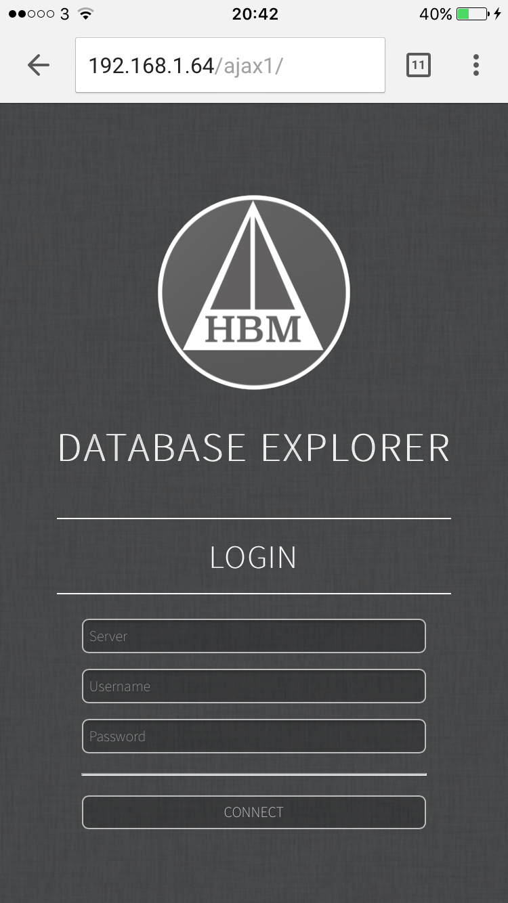
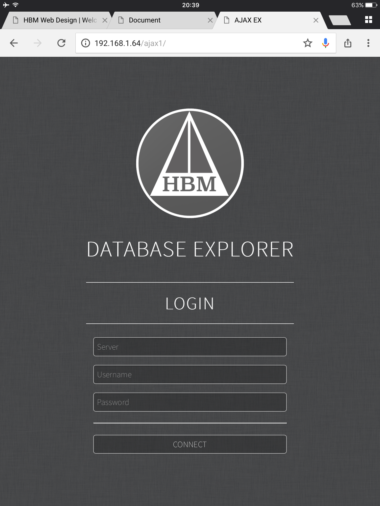

# MySQL-Explorer

Login to your MySQL server:

Select a database:

Select a table:

Table fields and rows will be presented:

MySQL Explorer can be used on every resolution device.
From mobile devices, to 4K ultra wide monitors in portrait mode.

iPhone 6:

iPad Air:

